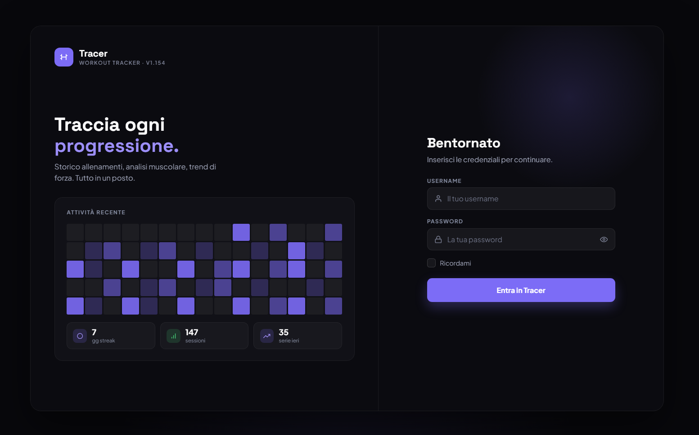
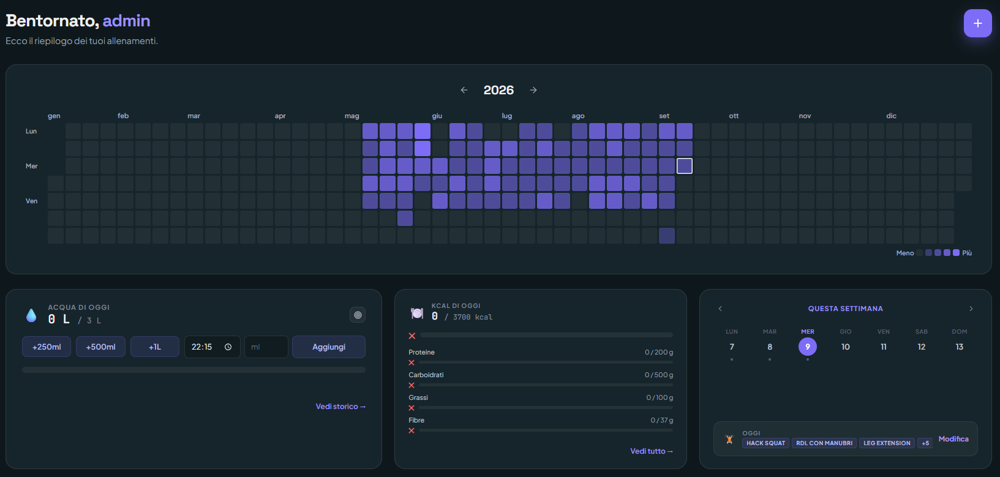

# Tracer

Un workout tracker personale, costruito un pezzo alla volta attorno a come si allena davvero chi lo usa — non attorno a un template generico da app fitness.

Non è pensato per "gamificare" l'allenamento o inondarti di statistiche. È pensato per essere il quaderno digitale che tieni in palestra: veloce da aggiornare tra una serie e l'altra, capace di ricordare tutto quello che scrivi, e onesto sui limiti di quello che non sa ancora fare.



---

## Indice

- [L'idea di fondo](#lidea-di-fondo)
- [Funzionalità](#funzionalità)
  - [Allenamenti](#allenamenti)
  - [Catalogo esercizi](#catalogo-esercizi)
  - [Dashboard](#dashboard)
  - [Acqua](#acqua)
  - [Integratori](#integratori)
  - [Misurazioni](#misurazioni)
  - [Atleti e profili](#atleti-e-profili)
  - [Backup](#backup)
- [Com'è fatto](#comè-fatto)
- [Avvio in locale](#avvio-in-locale)
- [Struttura del progetto](#struttura-del-progetto)

---

## L'idea di fondo

Tutto ruota attorno a un'unità semplice: la **sessione**, cioè un allenamento di una giornata. Dentro una sessione succedono due cose:

- registri **serie** — un esercizio, ripetizioni o durata, peso, recupero, ed eventuali qualificatori (se è di avviamento, se è portata a cedimento, se è un richiamo, se va fatta per lato, se c'è una sbarra da sommare al carico);
- oppure costruisci un **circuito** — un gruppo di esercizi da ripetere per un certo numero di round, con un recupero condiviso tra un round e l'altro, distinto dal recupero delle singole serie.

Ogni esercizio che scrivi viene raggruppato automaticamente: espandendolo vedi tutte le serie fatte per quel movimento in quella giornata, riordinabili trascinandole, modificabili una a una senza perdere il contesto delle altre.

Una sessione, oltre alle serie, può portare con sé il contorno che la rende un ricordo e non solo un log: dove ti sei allenato, a che ora, quanto è durata, il tuo peso corporeo quel giorno, il nome che le dai, e con chi.

## Funzionalità



### Allenamenti

Aggiunta rapida delle serie con autocomplete sugli esercizi già catalogati, modifica inline, duplicazione di una singola serie o dell'intera sessione, riordino via drag & drop sia degli esercizi che delle singole serie al loro interno. I circuiti si possono costruire da zero oppure importare di peso da una sessione passata — utile quando rifai lo stesso allenamento a distanza di settimane senza doverlo riscrivere. Ogni sessione può avere un nome, oltre a data, luogo, orario, durata e compagni di allenamento.

### Catalogo esercizi

Ogni esercizio ha un nome, una tipologia, dei tag muscolari e, opzionalmente, immagini o animazioni di riferimento. Una **mappa del corpo umano interattiva** permette di navigare gli esercizi per gruppo muscolare invece che per nome, mostrando i primi risultati con un link per vedere il resto nel catalogo completo.

### Dashboard

- **Settimana**: la striscia dei 7 giorni mostra, per ogni giorno selezionato, i muscoli lavorati davvero (dedotti dalle serie fatte, non da un piano teorico) e permette di creare al volo una nuova sessione per quel giorno o aprire quella già esistente.
- **Heatmap annuale**: colpo d'occhio sulla costanza degli allenamenti mese per mese, con navigazione tra gli anni.
- **Andamento peso per esercizio**: grafico nel tempo del peso sollevato su un movimento specifico.
- **Programmazione settimanale**: riepilogo esteso della settimana corrente giorno per giorno, esportabile in PDF per chi la stampa o la condivide con un trainer.

### Acqua

Log giornaliero dell'acqua bevuta, con obiettivo personalizzabile (anche per singola giornata), aggiunte rapide o a quantità precisa, storico consultabile e una heatmap annuale colorata in base a quanto ci si è avvicinati all'obiettivo ogni giorno.

### Integratori

Registro di creatina, aminoacidi e proteine assunti giorno per giorno, con quantità in grammi, filtro per data e vista aggregata per capire a colpo d'occhio cosa si è preso in un determinato periodo.

### Misurazioni

Peso corporeo, altezza, percentuale di massa grassa e circonferenze (vita, torace, braccia, cosce), una voce al giorno, con un grafico di andamento selezionabile per metrica. Pensato per restare separato dal peso che eventualmente annoti dentro una singola sessione: sono due gesti diversi, in due momenti diversi.

### Atleti e profili

Ogni utente ha un profilo che può essere pubblico o privato. Chi rende pubblico il proprio profilo permette ad altri di vedere il proprio storico, gli esercizi preferiti e la heatmap, e di importare una loro sessione come punto di partenza per un proprio allenamento. Il proprietario del profilo vede in più una striscia di allenamento settimanale consecutiva e — visibile solo a lui — l'andamento del proprio peso corporeo nel tempo.

### Backup

Le sessioni (e il catalogo esercizi) si esportano e importano in JSON, per chi vuole un backup indipendente dal database o vuole spostare i propri dati altrove.

## Com'è fatto

- **Backend**: Django 6, database MySQL sia in locale che in produzione.
- **Frontend**: nessun framework JavaScript — template Django con JavaScript vanilla dove serve interattività (drag & drop, autocomplete, grafici via [Chart.js](https://www.chartjs.org/), heatmap via [cal-heatmap](https://cal-heatmap.com/)), pensati per restare leggeri e comprensibili riga per riga piuttosto che dipendere da una build chain.
- **Deploy**: PythonAnywhere, con `SECRET_KEY` e `DB_PASSWORD` forniti da variabili d'ambiente in produzione. `STATIC_ROOT` (`staticfiles/`) è separato da `STATICFILES_DIRS` (`static/`): un `git pull` aggiorna solo la seconda, quindi va sempre seguito da `python manage.py collectstatic --noinput` prima del reload, altrimenti CSS/JS serviti in produzione restano quelli vecchi anche se il codice sorgente è aggiornato (successo gia' una volta: dopo aver cambiato `style.css` il sito continuava a servire una versione di mesi prima perché mancava questo passaggio).

**Checklist ad ogni deploy**: `git pull` → `python manage.py migrate` (se ci sono migrazioni nuove) → `python manage.py collectstatic --noinput` (se sono cambiati CSS/JS/immagini in `static/`) → reload della web app dalla dashboard PythonAnywhere.

Il tema è viola scuro, disegnato prima come mockup statici e poi portato dentro l'app pagina per pagina, mantenendo lo stesso linguaggio visivo — stessi colori, stessi badge, stesse card — su dashboard, sessione, profilo e le pagine più recenti come acqua e misurazioni.

## Avvio in locale

Prerequisiti: Python 3, un server MySQL raggiungibile in locale.

```bash
git clone <url-di-questo-repo>
cd TracerGym
pip install -r requirements.txt

# Crea il database locale (nome, utente e password di default sono in core/settings.py)
mysql -u root -p -e "CREATE DATABASE tracker CHARACTER SET utf8mb4"

python manage.py migrate
python manage.py createsuperuser
python manage.py runserver
```

L'app parte su `http://127.0.0.1:8000/`.

## Struttura del progetto

```
core/                  Settings, URL root, WSGI
tracker/
  models.py             Sessioni, serie, circuiti, esercizi, misurazioni, acqua, integratori, profili
  views.py               Logica di tutte le pagine e degli endpoint AJAX
  urls.py                 Routing
  management/commands/    Comandi custom
  templates/tracker/       Template per pagina
  migrations/               Storico dello schema del database
```
